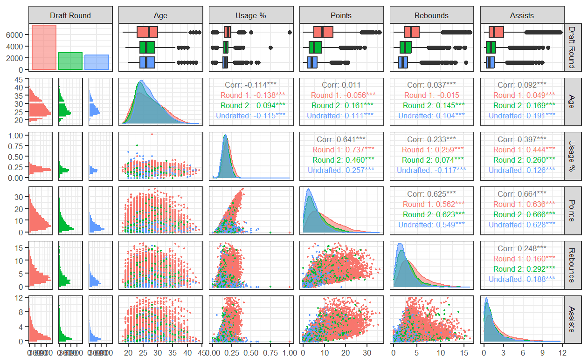
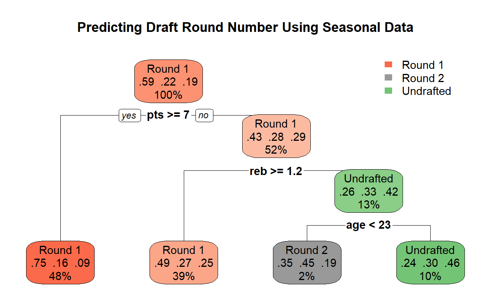
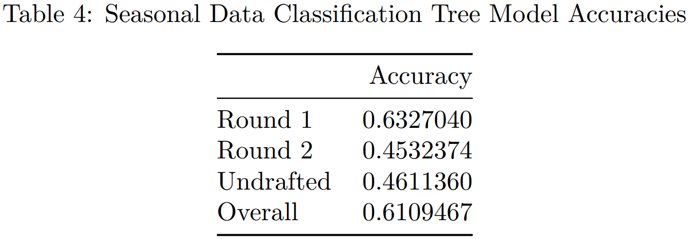
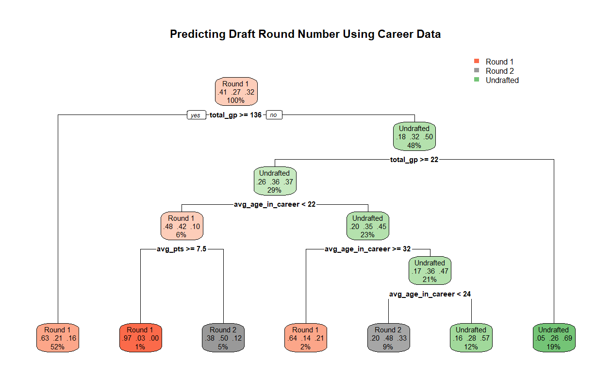
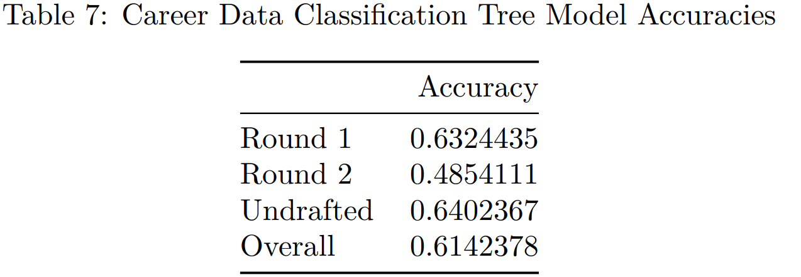
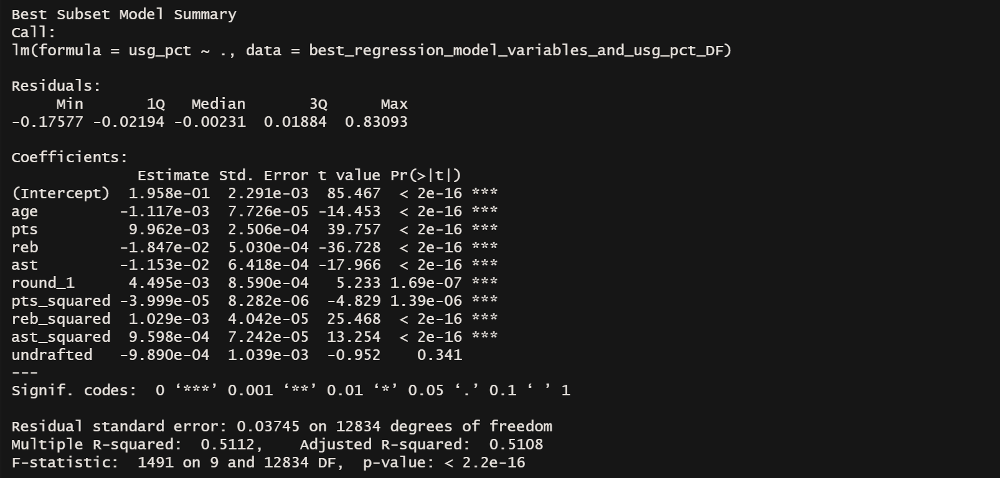
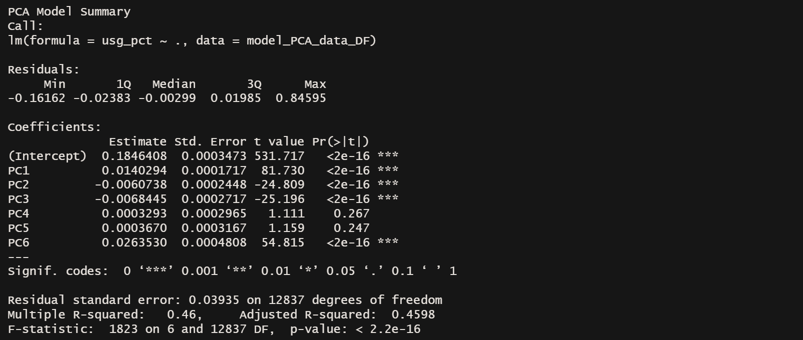

# Comprehensive Statistical Analysis of NBA Players (1996-2022)

_Analyzing Physical Traits, College Backgrounds, and Performance Trends of NBA Players_

This project performs a comprehensive statistical analysis of NBA players from the 1996 to 2022 seasons. It uses demographic and performance data to explore draft outcomes, usage rates, and key performance indicators, blending data science, sports analytics, and machine learning using R.

---

## Table of Contents

- [Project Overview](#project-overview)  
- [Features](#features)  
- [Tech Stack](#tech-stack)
- [Dataset Description](#dataset-description)
- [Methodology](#methodology)
- [Results](results)
- [Running the Code](#️running-the-code)
- [Author](#️author)
- [License](#license)  

---

## Project Overview

The project investigates how physical attributes (age, height, weight), college origins, and career averages affect player performance and draft placement. Statistical models, correlation matrices, and decision trees are used to explore trends and predict draft rounds based on player metrics.

---

## Features

### Physical Attributes vs Performance
- Correlation matrix and scatterplots of traits vs. key performance indicators  
- Heatmaps to visualize relationships

### College Performance Summary
- Aggregated stats by college  
- Custom thresholds to filter high-output schools  
- Boxplots and histograms for per-college metrics

### Seasonal vs Career Model Comparison
- Predicts draft round using decision trees trained on seasonal and career averages  
- Accuracy comparison with confusion matrices

### Regression & PCA
- Best subset regression and principal component analysis to model `usg_pct` (usage rate)  
- Evaluation via R² and residual plots

---

## Tech Stack

**Languages:**  
- R  
- R Markdown

**Key Packages:**

| Package       | Purpose                          |
|---------------|-----------------------------------|
| `ggplot2`     | Visualizations                    |
| `GGally`      | Correlation (ggpairs) matrix      |
| `dplyr`, `plyr` | Data wrangling                 |
| `rpart`, `rpart.plot` | Classification trees     |
| `leaps`       | Best subset regression            |
| `knitr`       | Table rendering in reports        |

---

## Methodology

1. **Data Cleaning**  
   - Filtered rows with missing values  
   - Reformatted draft numbers into modern draft round categories

2. **Exploratory Analysis**  
   - Correlation analysis of physical and performance variables  
   - College-level aggregations and visualizations

3. **Predictive Modeling**  
   - Classification trees on seasonal vs. career stats  
   - Linear regression and PCA for usage rate prediction

4. **Reproducibility**  
   - Modularized analysis in R Markdown  
   - Suggestions for `renv` and automation included

---

## Dataset Description

Original dataset from Kaggle:
- [NBA Players Dataset](https://www.kaggle.com/datasets/justinas/nba-players-data) by Justinas Cirtautas
- Contains data from the 1996–2022 NBA seasons
- 12K+ NBA records × 20+ variables

**Note**: The dataset is *not included in this repository* due to licensing restrictions and potential proprietary content from third-party sources (e.g., Basketball Reference). To reproduce this project, please download `all_seasons.csv` manually from Kaggle and place it in the same folder as `NBA_players_analysis.Rmd`.

### Sample Columns

| Column              | Description                                                     |
|---------------------|-----------------------------------------------------------------|
| `player_name`       | Name of the NBA player                                          |
| `age`               | Age of the player                                               |
| `player_height`     | Height of the player in centimeters                             |
| `player_weight`     | Weight of the player in kilograms                               |
| `college`           | College attended by the player                                  |
| `country`           | Country of birth of the player                                  |
| `draft_year`        | Year the player was drafted                                     |
| `draft_round`       | Draft round in which the player was selected                    |
| `gp`                | Number of games played by the player                            |
| `pts`               | Average points scored per game                                  |
| `reb`               | Average rebounds per game                                       |
| `ast`               | Average assists per game                                        |
| `net_rating`        | Team point differential per 100 possessions with the player on court |
| `oreb_pct`          | Offensive rebound percentage                                     |
| `dreb_pct`          | Defensive rebound percentage                                     |
| `usg_pct`           | Percentage of team plays used by the player on court            |
| `ts_pct`            | True shooting percentage (incorporates free throws and 2/3 point shots) |
| `ast_pct`           | Percentage of teammate field goals assisted by the player       |
| `season`            | NBA season data belongs to   

---

## Results

### NBA Player Performance Trends Through ggpairs Plot
 

- First-round players show a wider range of performance metrics, with higher potential but more variability, while undrafted players display more consistency in their performance, albeit at lower levels.
- Usage rate has a strong positive correlation with points scored, particularly for first-round players, highlighting that higher usage players are typically more involved in scoring.
- Age has a weak correlation with performance, indicating that factors like skill, team fit, and opportunities are more influential than age in determining a player’s success.

### NBA Draft Round Prediction Via Classification Trees





- Seasonal data, including metrics like average points scored per game (pts), is helpful for predicting first-round players, as their performance in one season may be more reflective of their potential.
- Career data, which aggregates performance across seasons, improves the model's ability to predict undrafted players, who may not have standout seasons but show consistent performance over their careers. This leads to higher prediction accuracy for undrafted players (increased from 46.11% to 64.02%).
- The career data model improves overall accuracy, slightly raising the overall prediction rate from 61.09% to 61.42%, by balancing predictions for both high-performing and less visible players.

### Predicting NBA Player Usage Rate Using Best Subset Selection and PCA



- Best Subset Regression with variables like age, points, rebounds, and assists explains 51.08% of the variance in usage rate, showing strong predictive power.
- PCA reduces the dataset’s dimensions but performs less accurately, explaining only 45.98% of the variance in usage rate.
- Best Subset Regression outperforms PCA in accuracy for predicting usage rate, as evidenced by lower residual errors and higher regression model fit.

---

## Running the Code

### Install Required Packages

```r
install.packages(c(
  "ggplot2", "GGally", "rpart", "rpart.plot",
  "dplyr", "plyr", "leaps", "knitr"
))
```

### Render the RMarkdown File

Open `NBA_players_analysis.Rmd` in RStudio, then:
- Click Knit → PDF/HTML
- Or use console:
```r
rmarkdown::render("NBA_players_analysis.Rmd", output_format = "pdf_document")
```

---

## Author
**Matthew Badal-Badalian**  
*MDSAI Graduate, University of Waterloo*  

### Links
- [LinkedIn](https://www.linkedin.com/in/badal/)    
- [GitHub](https://github.com/mbadalbadalian)

---

## License
All original analysis code is released under the [`MIT License`](./LICENSE) © 2025 Matthew Badal-Badalian.

The dataset is the property of its original creator and hosted on Kaggle.

Redistribution of the dataset is not permitted via this repository.
